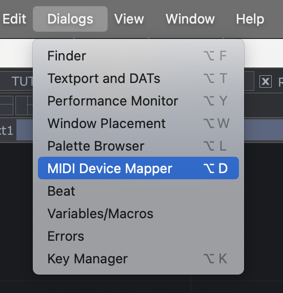
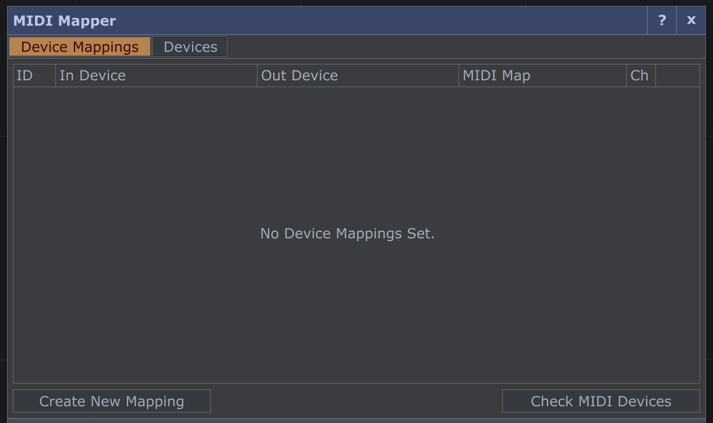
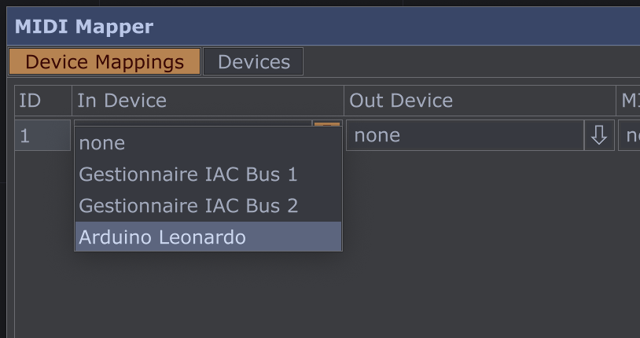
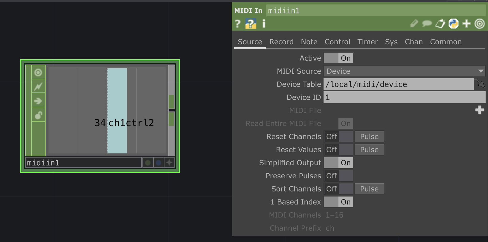

# Envoyer du MIDI avec Arduino

*Ou comment communiquer en MIDI en utilisant une carte Arduino comme controleur MIDI.*

English version [here](https://github.com/LucieMrc/Arduino_MIDI_USB_EN)

- Le cours d'[introduction à Arduino](https://www.valentindupas.com/courses/arduino/1-_Arduino_from_the_ground_up) (EN) de Valentin 
- L'[introduction à Arduino et aux capteurs](https://github.com/b2renger/Introduction_Arduino) de B2renger

## Le MIDI

Le MIDI (Musical Instrument Digital Interface) est un protocole de communication pour la musique, utilisé le plus souvent pour la communication entre instruments électroniques, contrôleurs, et logiciels de musique.

Les données midi sont communiquées sur 16 channels, et ont une range de 0 à 127. Il y a donc 128 notes par channels, et 128 control changes.

## Envoyer le MIDI avec Arduino

*La [liste des fonctions](https://arduinomidilib.sourceforge.net/a00001.html) de la librairie MIDI Arduino.*

Il faut utiliser une librairie pour la communication MIDI en USB, ici on utilise [USB-MIDI](https://github.com/lathoub/Arduino-USBMIDI).

Pour créer une instance midi, on utilise la fonction `USBMIDI_CREATE_DEFAULT_INSTANCE();`

Dans le setup(), on utilise `MIDI.begin(4);` pour démarrer la communication midi et écouter le channel 4.

### Envoyer et arrêter une note

On peut ensuite utiliser la fonction `MIDI.sendNoteOn(a, b, c);` pour envoyer une note, où l'argument **a** est la note (de 0 à 127), l'argument **b** est la vélocité ( = la vitesse d'enfoncement de la touche du clavier, de 0 à 127), et l'argument **c** est le channel (de 0 à 16).
On procède de la même manière pour arrêter une note avec la fonction `MIDI.sendNoteOff(a, b, c);`.

Ainsi dans le code d'exemple de la librairie "Basic_IO", 
```
        MIDI.sendNoteOn(42, 127, 1);
        delay(1000);
        MIDI.sendNoteOff(42, 0, 1); 
        delay(1000);
```
On envoie la note 42, avec une vélocité de 127, sur le channel 1, puis on l'arrête 1 seconde après.

*[Ressource](https://www.phys.unsw.edu.au/jw/notes.html) sur les notes, leur valeur midi et les équivalents en notation américaine et en fréquence sur le site de l'UNSW.*

### Envoyer un Control Change

On utilise la fonction `MIDI.sendControlChange(a, b, c);` où l'argument **a** est le numéro du contrôle (de 0 à 127), l'argument **b** est la valeur (de 0 à 127) et l'argument **c** est le channel (de 0 à 16). 

<!-- ### Boutons et potentiomètres

### MPR121 // détails

On peut utiliser un MPR121 afin de créer ses propres capteurs capacitifs, -->

## Recevoir le MIDI dans TouchDesigner

Pour recevoir le signal MIDI dans TouchDesigner il faut tout d'abord créer l'entrée MIDI du contrôleur.



On va dans Dialogs > MIDI Device Mapper.



Créer l'entrée avec `Create New Mapping`.



Sélectionner la carte Arduino dans la colonne "In Device".



En créant un `Midi In` CHOP dans le network, on récupère les messages MIDI arrivants.

# Pour aller + loin

- interfaces souples
- arduino DMX ??# Arduino_MIDI_USB_FR
