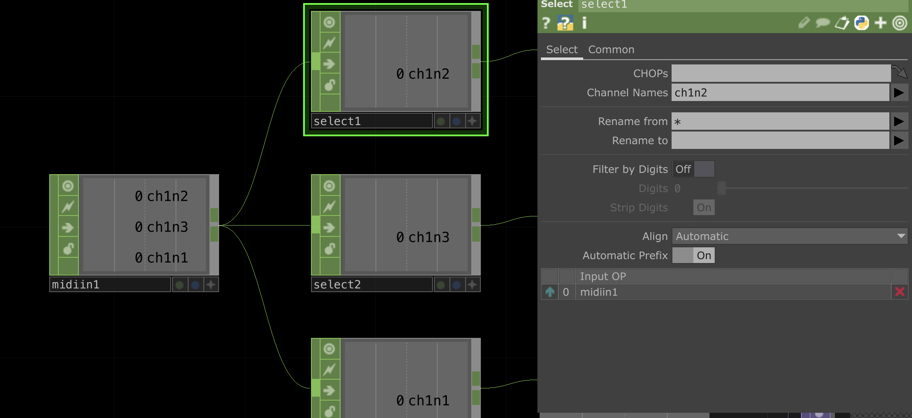
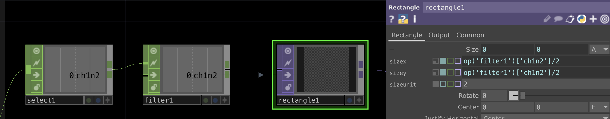
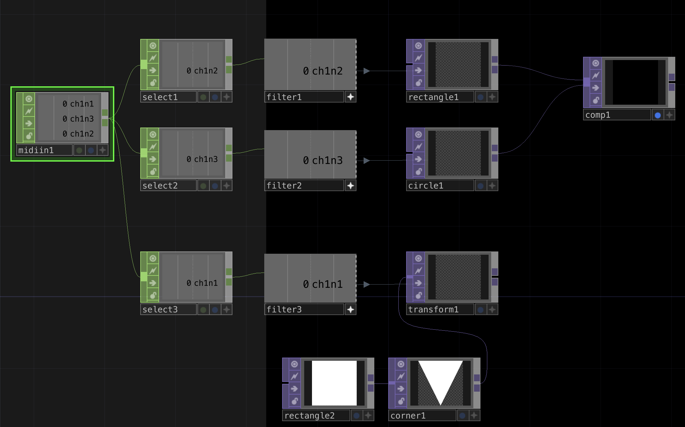

# Envoyer du MIDI avec Arduino

*Ou comment communiquer en MIDI en utilisant une carte Arduino comme controleur MIDI.*

English version [here](https://github.com/LucieMrc/Arduino_MIDI_USB_EN)

- Le cours d'[introduction à Arduino](https://www.valentindupas.com/courses/arduino/1-_Arduino_from_the_ground_up) (EN) de Valentin 
- L'[introduction à Arduino et aux capteurs](https://github.com/b2renger/Introduction_Arduino) de B2renger

https://github.com/user-attachments/assets/c2010b42-fa77-4d7c-9026-c64da561116d

*Formes interactives qui apparaissent dans TouchDesigner lorsqu'on détecte qu'une forme feutrée connectée à une Arduino Leonardo est touchée.*

## Le MIDI

Le MIDI (Musical Instrument Digital Interface) est un protocole de communication pour la musique, utilisé le plus souvent pour la communication entre instruments électroniques, contrôleurs, et logiciels de musique.

Les données midi sont communiquées sur 16 channels, et ont une range de 0 à 127. Il y a donc 128 notes par channels, et 128 control changes.

## Envoyer le MIDI avec Arduino

Toutes les cartes Arduino ne sont pas mesures d'être reconnues en tant que controleur midi en USB par l'ordinateur. Ce tutoriel fonctionne avec une **Leonardo**, mais ne fonctionnait pas avec une Uno ou une Due par exemple.

Il faut utiliser une librairie pour la communication MIDI en USB, ici on utilise [USB-MIDI](https://github.com/lathoub/Arduino-USBMIDI).

Pour créer une instance midi, on utilise la fonction `USBMIDI_CREATE_DEFAULT_INSTANCE();`

Dans le setup(), on utilise `MIDI.begin(4);` pour démarrer la communication midi et écouter le channel 4.

*La [liste des fonctions](https://arduinomidilib.sourceforge.net/a00001.html) de la librairie MIDI Arduino.*

### Envoyer et arrêter une note

On peut ensuite utiliser la fonction `MIDI.sendNoteOn(a, b, c);` pour envoyer une note, où l'argument **a** est la note (de 0 à 127), l'argument **b** est la vélocité ( = la vitesse d'enfoncement de la touche du clavier, de 0 à 127), et l'argument **c** est le channel (de 0 à 16).
On procède de la même manière pour arrêter une note avec la fonction `MIDI.sendNoteOff(a, b, c);`.

Ainsi dans une version du code d'exemple de la librairie "Basic_IO", 
```
#include <USB-MIDI.h>

USBMIDI_CREATE_DEFAULT_INSTANCE();

void setup() {
    MIDI.begin(4);
}

void loop() {
    MIDI.sendNoteOn(42, 127, 1);
    delay(1000);
    MIDI.sendNoteOff(42, 0, 1); 
    delay(1000);
}
```
On envoie la note 42, avec une vélocité de 127, sur le channel 1, puis on l'arrête 1 seconde après.

*[Ressource](https://www.phys.unsw.edu.au/jw/notes.html) sur les notes, leur valeur midi et les équivalents en notation américaine et en fréquence sur le site de l'UNSW.*

### Envoyer un Control Change

On utilise la fonction `MIDI.sendControlChange(a, b, c);` où l'argument **a** est le numéro du contrôle (de 0 à 127), l'argument **b** est la valeur (de 0 à 127) et l'argument **c** est le channel (de 0 à 16). 

<!-- ### Boutons et potentiomètres

### MPR121 // détails

On peut utiliser un MPR121 afin de créer ses propres capteurs capacitifs, -->

## Recevoir le MIDI dans TouchDesigner

Pour recevoir le signal MIDI dans TouchDesigner il faut tout d'abord créer l'entrée MIDI du contrôleur.


On va dans Dialogs > MIDI Device Mapper.


Créer l'entrée avec `Create New Mapping`.


Sélectionner la carte Arduino dans la colonne "In Device".


En créant un `Midi In` CHOP dans le network, on récupère les messages MIDI arrivants.

## Projet exemple : les formes

### Dans Arduino

Pour faire apparaître des formes dans TouchDesigner en touchant des objets conducteurs comme dans la vidéo en haut de page, on utilise un MPR121.

Un MPR121 est un capteur capactif qui détecte si on touche une des ses douzes broches, ou n'importe quel objet conducteur relié aux broches. Ici, j'utilise de la laine conductrice que j'ai feutré en formes géométriques, reliées aux broches avec des câbles plantés dans les formes.

*[Lien](https://learn.adafruit.com/adafruit-mpr121-12-key-capacitive-touch-sensor-breakout-tutorial) de la ressource Adafruit du MPR121 avec le schéma de branchement.*

Pour utiliser un MPR121, on doit ajouter la librairie Adafruit_MPR121 au gestionnaire de librairie.

Dans le code Arduino, on fait en sorte qu'à chaque fois qu'on détecte qu'une broche est touchée (alors qu'elle ne l'était pas avant), alors on envoit une note correspondant au numéro de la broche.
Lorsqu'on arrête de toucher la broche en question, la note s'arrête.

Le code Arduino du fichier "MIDI_MPR121" :

```
#include <USB-MIDI.h>
#include <Wire.h>
#include "Adafruit_MPR121.h"

#ifndef _BV
#define _BV(bit) (1 << (bit))
#endif

Adafruit_MPR121 cap = Adafruit_MPR121();

uint16_t lasttouched = 0;
uint16_t currtouched = 0;

USBMIDI_CREATE_DEFAULT_INSTANCE();

void setup() {
  Serial.begin(9600);
  while (!Serial) {
    delay(10);
  }
  Serial.println("Adafruit MPR121 Capacitive Touch sensor test");
  if (!cap.begin(0x5A)) {
    Serial.println("MPR121 not found, check wiring?");
    while (1)
      ;
  }
  Serial.println("MPR121 found!");
  MIDI.begin(4);
}

void loop() {
  currtouched = cap.touched();    //check the pins states
  for (uint8_t i = 0; i < 12; i++) {    // for each twelve pins
    if ((currtouched & _BV(i)) && !(lasttouched & _BV(i))) {        // if the pin was untouched and is now being touched
      Serial.print(i);
      Serial.println(" touched");
      MIDI.sendNoteOn(i, 127, 1);   // sends which pin is touched as a midi note
    }
    if (!(currtouched & _BV(i)) && (lasttouched & _BV(i))) {        // if it was touched and it is now not touched
      Serial.print(i);
      Serial.println(" released");
      MIDI.sendNoteOff(i, 0, 1);    // stops the note
    }
  }
  lasttouched = currtouched;    //each pin state is now the previous state
}
```
### Dans Touchdesigner

Dans TouchDesigner, on crée donc un `Midi In` CHOP afin de récupérer les données midi arrivantes. On voit apparaître les notes correspondants à chacunes des broches au fur et à mesure qu'on les touche, sous la forme "ch1n**i**" où ch1 signifie le channel midi 1 et n**i** est le numéro de la broche que l'on a assigné en note.



En faisant un `Select` CHOP pour chaque note, on peux isoler la donnée afin d'avoir 0 ou 1 pour chaque note en fonction de si elle est en train d'être jouée ou non ( = si la broche correspondante est en train d'être touchée).



On rajoute ensuite un `Filter` CHOP afin d'avoir une transition entre le 0 et le 1 et adoucir l'animation. 

Enfin, on crée un `Rectangle` TOP et on lui donne comme Size la valeur en sortie du Filter, divisée par 2.



Le fichier "MIDI_reception.toe"

# Pour aller + loin

- interfaces souples
- arduino DMX ??
